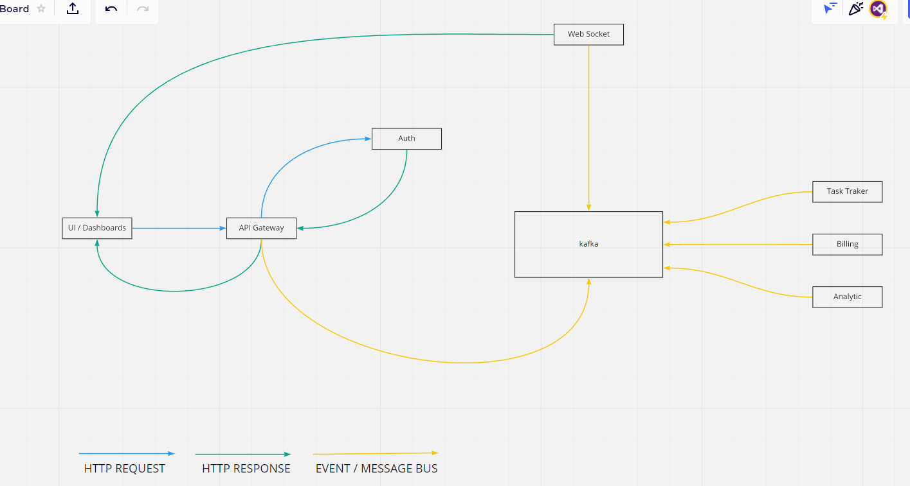

# Async Architecture

## Communication between microservices:

- Frontend (dashboards) communicate via API Gateway in HTTP request/response model
- API Gateway communicate via Auth service in HTTP request/response model
- API Gateway publish events to the kafka, other microservices listen for specific kafka topics
- Other microservices also publish some events (results) to the kafka topic
- User will get the result from microservices via Web Socket service (by sessionId or correlationId)
